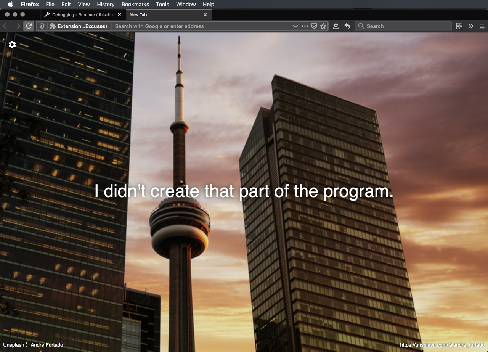
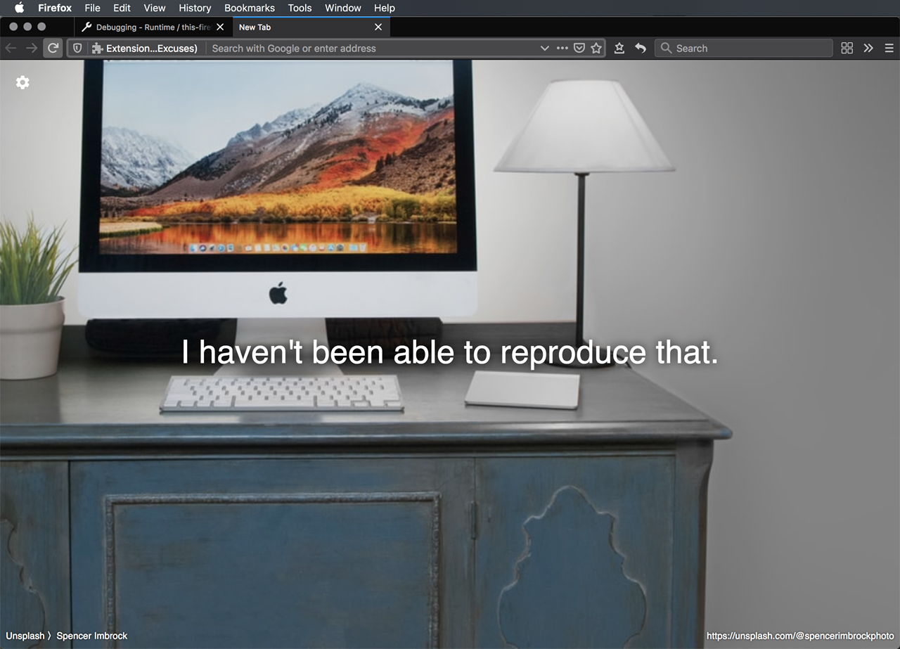
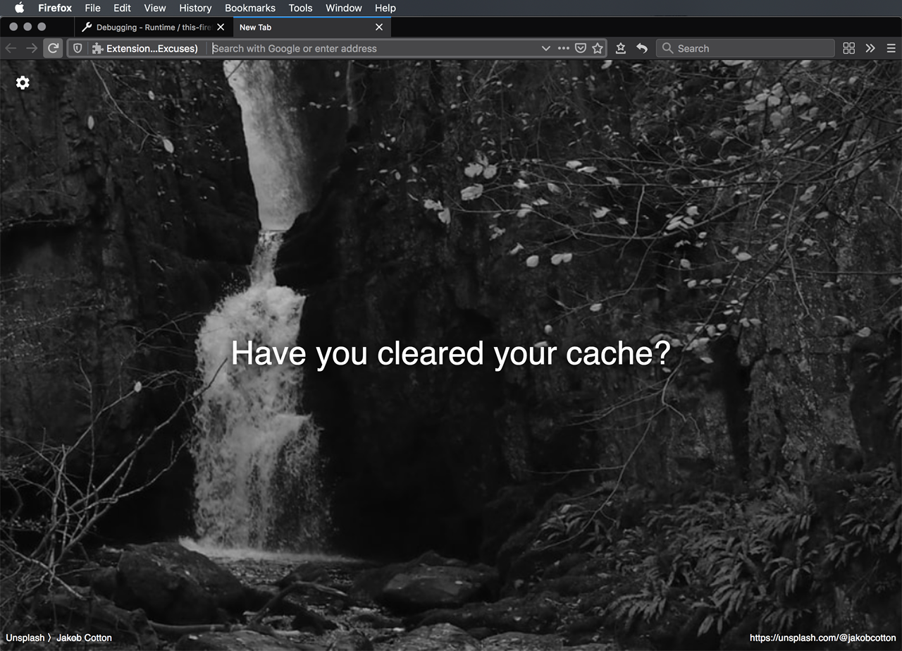
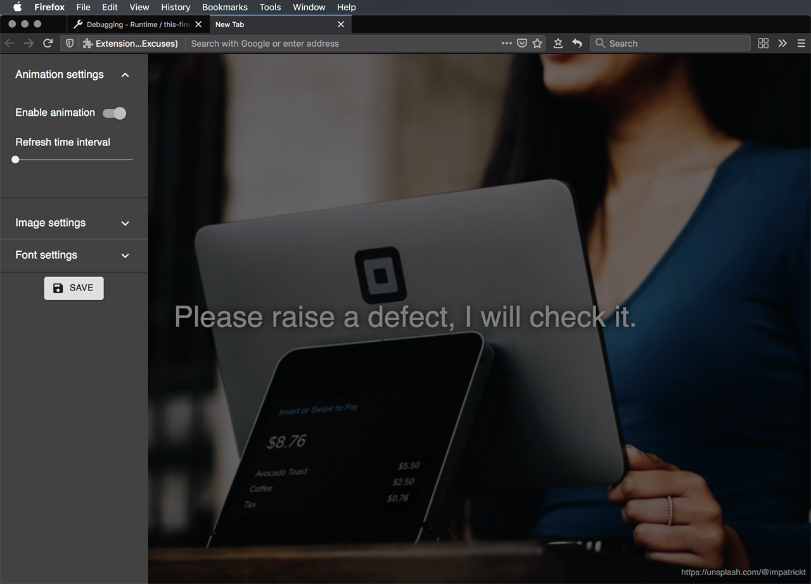
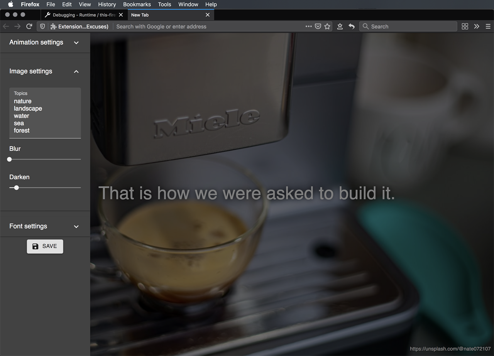
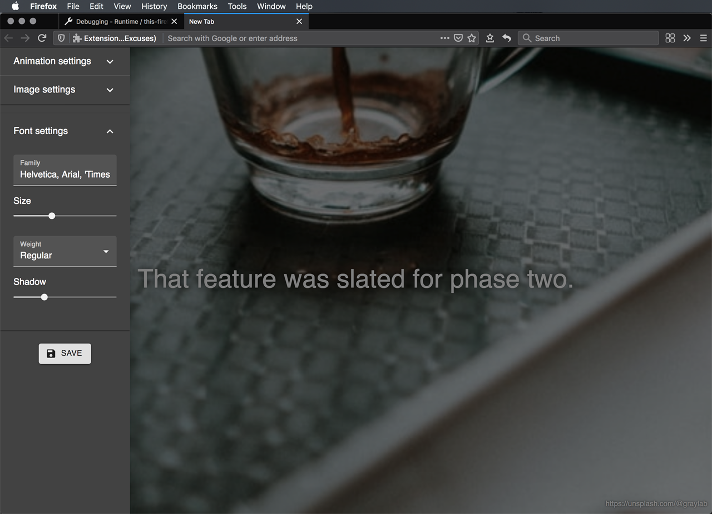

# Developer Excuses WebExtension
Overrides your new tabs with a random developer excuse over a beautiful photo background. Made with ❤

| Category      | Measurement                                                                                                                                                                                                                                                                                                                                                                                                                                                                                                                                                                                                                                                           |
|---------------|-----------------------------------------------------------------------------------------------------------------------------------------------------------------------------------------------------------------------------------------------------------------------------------------------------------------------------------------------------------------------------------------------------------------------------------------------------------------------------------------------------------------------------------------------------------------------------------------------------------------------------------------------------------------------|
| Pipeline      | [](https://circleci.com/gh/ayltai/developer-excuses-webextension)                                                                                                                                                                                                                                                                                                                                                                                                                                                                              |
| Quality       | [](https://app.codacy.com/app/AlanTai/developer-excuses-webextension/dashboard) [](https://sonarcloud.io/dashboard?id=ayltai_developer-excuses-webextension) [](https://sonarcloud.io/dashboard?id=ayltai_developer-excuses-webextension)               |
| Coverage      | [](https://codecov.io/gh/ayltai/developer-excuses-webextension) [](https://sonarcloud.io/dashboard?id=ayltai_developer-excuses-webextension)                                                                                                                                                                                                                                                                           |
| Rating        | [](https://sonarcloud.io/dashboard?id=ayltai_developer-excuses-webextension) [](https://sonarcloud.io/dashboard?id=ayltai_developer-excuses-webextension) [](https://sonarcloud.io/dashboard?id=ayltai_developer-excuses-webextension) |
| Security      | [](https://sonarcloud.io/dashboard?id=ayltai_developer-excuses-webextension) [](https://sonarcloud.io/dashboard?id=ayltai_developer-excuses-webextension)                                                                                                                                                                                                                           |
| Miscellaneous |  [](https://github.com/ayltai/developer-excuses-webextension/releases) [](https://github.com/ayltai/developer-excuses-webextension/blob/master/LICENSE)                                                                                                                                                                                                                                        |

A Firefox/Chrome/Edge extension that overrides your new tabs with a random developer excuse over a beautiful photo background.

Available at: https://addons.mozilla.org/addon/animated-developer-excuses/













## Features
* Periodically refresh the background image from [Unsplash](https://unsplash.com/)
* Periodically refresh the quote from [Developer Excuses](http://www.devexcuses.com/)
* Animate the background image with [Ken Burns effect](https://en.wikipedia.org/wiki/Ken_Burns_effect)

## Getting started
You can build this project using macOS or Linux.

### Install
1. Install [NodeJS](https://nodejs.org)
2. Install dependencies
   ```sh
   npm i -D
   ```

### Configure
Specify the URL of your Unsplash API proxy:
```sh
export REACT_APP_UNSPLASH_API_ENDPOINT=https://unsplash-api-proxy.appspot.com
```

### Build
```sh
npm run build
```

### Run
```sh
npm start
```

## Acknowledgements
This software is made with the support of open source projects:
* [NodeJS](https://nodejs.org)
* [React](https://github.com/facebook/react)
* [Create React App](https://github.com/facebook/create-react-app)
* [Material UI](https://material-ui.com)
* [Unsplash](https://github.com/unsplash/unsplash-js)
* [kenburns](https://github.com/gre/kenburns)
* [rect-crop](https://github.com/gre/rect-crop)
* [ESLint](https://eslint.org)
* [Stylelint](https://stylelint.io)
* [Enzyme](https://airbnb.io/enzyme)
* [web-ext](https://github.com/mozilla/web-ext)

... and closed source services:
* [CircleCI](https://circleci.com)
* [SonarCloud](https://sonarcloud.io)
